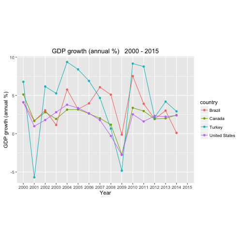

Data Products Project-World Development Indicators
========================================================
author: Kyle Pei
date: July 3 2016
autosize: true

Introduction
========================================================

[DataBank](http://databank.worldbank.org/data/home.aspx) is an analysis and visualisation tool that contains collections of time series data on variety of topics.

This Shiny App try to visualize world development indicators, the [dataset](http://databank.worldbank.org/data/AjaxDownload/FileDownloadHandler.ashx?filename=b8634c7a-ce88-4d8e-b646-9b824c8cdfda.zip&filetype=CSV&language=en&displayfile=Popular%20indicators.zip) has 20 types
of indicators, like "GDP growth", "Population", "Internet users" etc. You can select a indicator and
your preferred countries to view the development trends, and do some comparison.


Shiny App: <https://ppln.shinyapps.io/coursera-dataproducts-project/>

Github: <https://github.com/ppln/coursera-dataproducts-project>

Data Exploration
========================================================


```r
library(knitr)
library(ggplot2)
library(reshape2)
```


```r
# load data
my_data <- read.csv('./data/Data.csv', header = TRUE, na.strings = '..', nrows = 4920)
head(my_data)
summary(my_data)
```

Processing Code
========================================================


```r
# edit colnames
colnames(my_data)[5:20] <- c(2000:2015)

# extract the subset data
seriesName <- "GDP growth (annual %)"
countries <- c("Brazil", "Canada", "United States", "Turkey")

subset <- my_data[my_data$Series.Name == seriesName & my_data$Country.Name %in% countries, ]
rownames(subset) <- subset$Country.Name
subset <- subset[, -c(1:4)]
            
# convert data frame
subset$country <- row.names(subset)
subset <- melt(subset, "country")
```

Processing Code
========================================================


```r
# plot
ggplot(subset, aes(variable, value, group = country, color = country)) + 
        geom_line() + geom_point() + 
        ggtitle(paste(seriesName, ' ', "2000 - 2015")) + 
        xlab('Year') + ylab(seriesName) + coord_fixed(ratio = 7/10)
```



